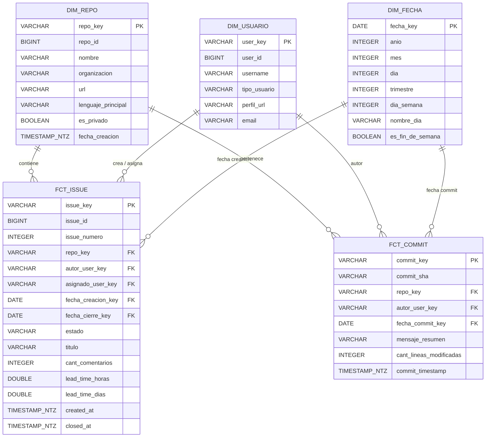

# Esquema Dimensional en Estrella (Star Schema)

El data warehouse analítico se estructura bajo un esquema en estrella con 3 dimensiones y 2 tablas de hechos:

### Granularidad de las Tablas
1. **`dim_repo`**: Un registro por repositorio de GitHub administrado.
2. **`dim_usuario`**: Un registro único por usuario/colaborador identificado en GitHub.
3. **`dim_fecha`**: Un registro por cada día calendario desde el año 2020 hasta 2030.
4. **`fct_issue`**: Un registro por cada Issue o Pull Request registrado en el ciclo de vida.
5. **`fct_commit`**: Un registro por cada commit registrado en las ramas principales de los repositorio.

